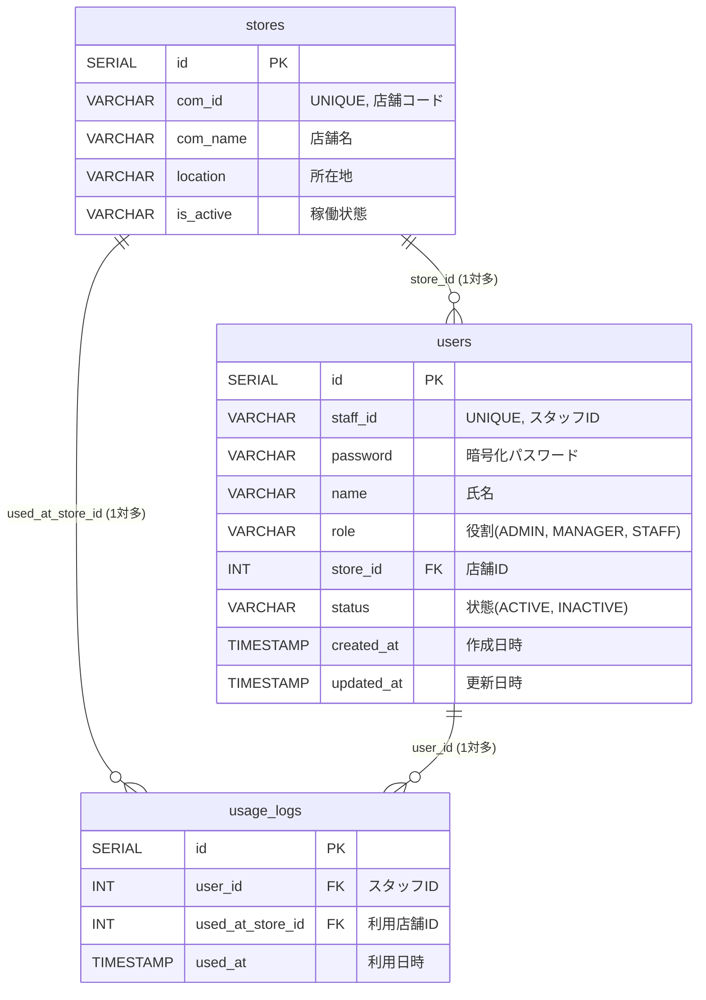

# 伊吉グループ スタッフカード＆クーポン管理システム 仕様詳細

本プロジェクトは、株式会社伊吉グループの店舗スタッフ向けの**デジタル社員証およびクーポン利用ログ管理システム**です。  
本ドキュメントでは、システムの構成、データベース設計、画面一覧、ビジネスロジックの詳細について細かく解説します。

---

## 1. プロジェクト概要

本システムは、伊吉グループ内の各店舗におけるスタッフ情報の管理と、スタッフが店舗利用時に提示するデジタル社員証、およびそれに付随するクーポン利用ログを管理する目的で開発されました。  
管理者、マネージャー、一般スタッフなどの権限ロールに応じた画面アクセス制限、および「同じ店舗でのクーポン利用は1日1回まで」とするビジネスルールが実装されています。

---

## 2. アーキテクチャと技術スタック

本システムは以下の技術スタックで構成されています。

### バックエンド
- **フレームワーク**: Spring Boot 3.5.13 (Java 17)
- **ビルドツール**: Maven (Maven Wrapper同梱)
- **データベース接続/データマッピング**: MyBatis (アノテーションMapper方式)
- **セキュリティ**: Spring Security (標準セッションベースの認証・認可)
- **パスワード暗号化**: BCrypt (強力なハッシュ化アルゴリズムによる安全な保存)
- **JWTユーティリティ**: JJWT (内部的にJWTトークンの生成・検証モジュールを保持)

### フロントエンド
- **テンプレートエンジン**: Thymeleaf (HTML5ベースのサーバーサイドレンダリング)
- **スタイリング**: Vanilla CSS

### インフラ・DB
- **データベース**: PostgreSQL 16 (コンテナイメージ `postgres:16-alpine` を使用)
- **コンテナ仮想化**: Docker / Docker Compose

---

## 3. データベース設計 (DB Schema)

データベース構成は、[01_schema.sql](file:///C:/Users/KamataRyunosuke/Desktop/BugerKingProject/Ikichi_StaffCard_Project/initdb.d/01_schema.sql) で定義されています。3つの主要テーブルから構成されます。

### ER図 (データベース関連図)



### テーブル詳細

#### ① `stores` テーブル (店舗マスタ)
店舗の基本情報を管理します。

| カラム名 | データ型 | 制約 | 説明 |
| :--- | :--- | :--- | :--- |
| `id` | `SERIAL` | `PRIMARY KEY` | システム内部用の店舗ID (自動採番) |
| `com_id` | `VARCHAR(20)` | `UNIQUE`, `NOT NULL` | 店舗コード (例: `h001` 等の識別ID) |
| `com_name` | `VARCHAR(100)` | `NOT NULL` | 店舗名 |
| `location` | `VARCHAR(255)` | - | 店舗の所在地 |
| `is_active` | `VARCHAR(255)` | - | 店舗の有効・無効状態 |

#### ② `users` テーブル (スタッフマスタ)
スタッフのアカウント情報を管理します。

| カラム名 | データ型 | 制約 | デフォルト値 | 説明 |
| :--- | :--- | :--- | :--- | :--- |
| `id` | `SERIAL` | `PRIMARY KEY` | - | システム内部用のユーザーID (自動採番) |
| `staff_id` | `VARCHAR(20)` | `UNIQUE`, `NOT NULL` | - | ログインに使用する業務用スタッフID (例: `s001`) |
| `password` | `VARCHAR(255)` | `NOT NULL` | - | BCryptでハッシュ化されたパスワード |
| `name` | `VARCHAR(50)` | `NOT NULL` | - | スタッフの氏名 |
| `role` | `VARCHAR(20)` | `NOT NULL` | - | 権限ロール (主に `ADMIN`, `MANAGER`, `STAFF`) |
| `store_id` | `INT` | `FOREIGN KEY` (stores.id) | - | 所属する店舗のID |
| `status` | `VARCHAR(20)` | - | `'ACTIVE'` | アカウント状態 (`ACTIVE` または `INACTIVE`) |
| `created_at` | `TIMESTAMP` | - | `CURRENT_TIMESTAMP` | 登録日時 |
| `updated_at` | `TIMESTAMP` | - | `CURRENT_TIMESTAMP` | 最終更新日時 |

#### ③ `usage_logs` テーブル (クーポン利用ログ)
スタッフによるクーポンの利用実績を記録します。

| カラム名 | データ型 | 制約 | デフォルト値 | 説明 |
| :--- | :--- | :--- | :--- | :--- |
| `id` | `SERIAL` | `PRIMARY KEY` | - | ログの個別ID (自動採番) |
| `user_id` | `INT` | `FOREIGN KEY` (users.id) | - | 利用したスタッフのユーザーID |
| `used_at_store_id` | `INT` | `FOREIGN KEY` (stores.id) | - | クーポンを利用した店舗のID |
| `used_at` | `TIMESTAMP` | - | `CURRENT_TIMESTAMP` | 利用が記録された日時 |

---

## 4. 画面遷移と機能一覧

システムは主にThymeleafテンプレートを使用したWeb画面アプリとして構成されています。ログインセッションが維持されることで各機能を利用できます。

```mermaid
flowchart TD
    Login["ログイン画面 (/auth/login)"]
    StaffCard["デジタル社員証・クーポン画面 (/users/card)"]
    StaffManager["スタッフ管理画面 (/users)"]
    StaffRegister["スタッフ登録画面 (/users/new)"]
    StoreManager["店舗管理画面 (/store)"]
    StoreDetail["店舗詳細画面 (/store/{id}/all)"]
    UsageLogs["利用ログ画面 (/usage)"]
    ChangePassword["パスワード変更画面 (/users/change-password)"]

    Login -->|ログイン成功| StaffManager
    Login -->|一般スタッフ| StaffCard
    StaffCard -->|パスワード変更| ChangePassword
    StaffManager -->|新規登録ボタン| StaffRegister
    StaffManager -->|店舗管理へ| StoreManager
    StaffManager -->|利用ログへ| UsageLogs
    StoreManager -->|店舗詳細| StoreDetail
    
    subgraph 認可エリア (ログイン必須)
        StaffCard
        StaffManager
        StaffRegister
        StoreManager
        StoreDetail
        UsageLogs
        ChangePassword
    end
```

### 画面別機能詳細

| 画面名 | URLパス | 主な機能 |
| :--- | :--- | :--- |
| **ログイン画面** | `/auth/login` | スタッフIDとパスワードによる認証。セッションの開始。 |
| **スタッフ管理画面** | `/users` | 全スタッフの確認、ステータス変更、パスワードリセット、ロールの更新、一括編集フォーム。 |
| **スタッフ登録画面** | `/users/new` | 新規スタッフの追加。所属店舗を選択して一括登録。 |
| **パスワード変更画面** | `/users/change-password` | 初回ログイン時のパスワード強制更新等のための画面。 |
| **デジタル社員証画面** | `/users/card` | 一般スタッフ向けのデジタル社員証。およびクーポン利用ボタン、利用済みタイマー表示。 |
| **店舗管理画面** | `/store` | 登録店舗の一覧取得。新規店舗の追加および既存店舗の情報編集。 |
| **店舗詳細画面** | `/store/{id}/all` | 指定店舗の詳細情報と、その店舗に所属しているスタッフの一覧表示。 |
| **利用ログ画面** | `/usage` | クーポン利用ログの全件を最新順（降順）で一覧表示。 |

---

## 5. ビジネスロジックと仕様詳細

### 5.1 認証・セキュリティ仕様
- **セッション認証 (`Spring Security`)**:
  - 設定クラス: [SecurityConfig.java](file:///C:/Users/KamataRyunosuke/Desktop/BugerKingProject/Ikichi_StaffCard_Project/src/main/java/org/example/ikichi_staffcard_project/auth/config/SecurityConfig.java)
  - `/auth/login`, `/auth/logout`, `/error`, および静的リソース (`/css/**`, `/js/**`, `/images/**`) は未ログインでもアクセス可能。
  - それ以外の全パス (`/users/**`, `/store/**`, `/usage/**`) へのアクセスはログインを必須とし、未認証アクセスは `/auth/login` に自動リダイレクト。
  - CSRF対策は一時的に無効化され、重複ログインは最大1セッションに制限。
- **ログイン処理 (`AuthController`)**:
  - `POST /auth/login` にてバリデーション（空チェック）を実行。
  - `AuthenticationService` が `AuthenticationManager` を使ってID/PWを照合（ハッシュ値は `BCryptPasswordEncoder` を使用）。
  - 照合成功後、`SecurityContextHolder` に認証情報（スタッフID）を設定し、セッション (`HttpSession`) にバインドして認証状態を維持。
  - セッションキー `"currentUser"` にログインレスポンスを保存。
- **JWTトークン生成モジュール**:
  - [JwtService.java](file:///C:/Users/KamataRyunosuke/Desktop/BugerKingProject/Ikichi_StaffCard_Project/src/main/java/org/example/ikichi_staffcard_project/auth/config/JwtService.java)
  - `generateToken(String staffId, String role)` をコールすると、`HS256` 署名されたJWTを発行。
  - 有効期限はプロパティ `jwt.expiration` から読み込まれ、デフォルト値は `86,400,000ミリ秒` (24時間) 。

### 5.2 スタッフ管理仕様
- **新規登録のパスワード自動付与**:
  - [UserController.java](file:///C:/Users/KamataRyunosuke/Desktop/BugerKingProject/Ikichi_StaffCard_Project/src/main/java/org/example/ikichi_staffcard_project/controller/UserController.java)
  - 登録画面でスタッフを新規作成する際、パスワードは一律で初期値 `"Welcome2026"` が自動設定される。
  - 暗号化されたパスワードが `users` テーブルへ保存され、画面には登録完了メッセージと共に初期パスワードが表示される。
- **バリデーションと入力制御**:
  - スタッフ情報一括編集時には、スタッフID (`staff_id`) および氏名 (`name`) の入力が必須。
  - 編集の際、ロール (`role`) およびステータス (`status`) は自動的に大文字（`ADMIN`, `MANAGER`, `STAFF` / `ACTIVE`, `INACTIVE`）に正規化されてデータベースに格納される。
- **ロール名の制限**:
  - [UserService.java](file:///C:/Users/KamataRyunosuke/Desktop/BugerKingProject/Ikichi_StaffCard_Project/src/main/java/org/example/ikichi_staffcard_project/service/UserService.java) の個別ロール変更 (`changeUserRole`) では、値が `admin`, `manager`, `staff` 以外のときは `RuntimeException("無効なロール名です")` をスローする。

### 5.3 店舗管理仕様
- **店舗所属ユーザーの結合取得**:
  - [StoreMapper.java](file:///C:/Users/KamataRyunosuke/Desktop/BugerKingProject/Ikichi_StaffCard_Project/src/main/java/org/example/ikichi_staffcard_project/mapper/StoreMapper.java)
  - 店舗の一覧取得 (`findAll`) および個別取得 (`findByIdWithUsers`) では、MyBatisの `@Many` アノテーションによる連鎖クエリを使用。これにより、店舗情報の取得と同時に、該当する `store_id` を持つユーザー情報がリスト形式で `Store` DTOに自動マッピングされる。
- **店舗新規追加と編集**:
  - 新規店舗登録時は、デフォルトで `is_active` が `true` の状態でインサートされる。
  - 店舗情報（店舗ID, 店舗名, 所在地）の更新時、店舗ID (`comId`) および店舗名 (`comName`) は入力必須。

### 5.4 クーポン利用・ログ管理仕様
- **同一店舗における1日1回制限ルール**:
  - [UsageLogService.java](file:///C:/Users/KamataRyunosuke/Desktop/BugerKingProject/Ikichi_StaffCard_Project/src/main/java/org/example/ikichi_staffcard_project/service/UsageLogService.java)
  - スタッフが特定の店舗でクーポンを利用しようとする際、システムは該当ユーザーが該当店舗において本日（サーバー時間基準の `0:00:00` から `23:59:59`）に既にクーポンを使用しているかどうかを、データベースからカウント（`countTodayUsageByStore`）してチェックする。
  - 既に1回以上利用ログが存在する場合は、例外 `RuntimeException("本日は既に使用済みです。この店舗のクーポンは1日1回まで利用可能です。")` がスローされ、二重使用を防止する。
- **クーポン利用後の5分間タイマー機能**:
  - [UsageLogController.java](file:///C:/Users/KamataRyunosuke/Desktop/BugerKingProject/Ikichi_StaffCard_Project/src/main/java/org/example/ikichi_staffcard_project/controller/UsageLogController.java)
  - スタッフがクーポンを利用（画面からPOST送信）し、ログ登録が完了すると、コントローラーは「現在時刻 + 5分間」となるミリ秒のタイムスタンプ `expireTime` を生成し、社員証画面 (`staff-card`) に引き渡す。
  - 画面側では、この時間に基づき「クーポンが有効である残時間」を示すカウントダウンタイマーが画面にリアルタイム表示される仕様となっている。
- **ログの可視化**:
  - ログ画面 (`/usage`) では、全件の利用ログが `users` および `stores` とINNER JOINで結合され、利用者名や利用店舗名が補完された状態で最新順（`ORDER BY used_at DESC`）で一覧表示される。

---

## 6. ディレクトリ構造と主要ファイル

プロジェクト内の主要なファイル配置と役割は以下の通りです。

- [pom.xml](file:///C:/Users/KamataRyunosuke/Desktop/BugerKingProject/Ikichi_StaffCard_Project/pom.xml) : 依存関係管理・Mavenビルド定義ファイル
- [docker-compose.yml](file:///C:/Users/KamataRyunosuke/Desktop/BugerKingProject/Ikichi_StaffCard_Project/docker-compose.yml) : DB用コンテナ定義ファイル
- [initdb.d/01_schema.sql](file:///C:/Users/KamataRyunosuke/Desktop/BugerKingProject/Ikichi_StaffCard_Project/initdb.d/01_schema.sql) : DBテーブルの初期定義・サンプルデータ投入スクリプト
- `src/main/java/org/example/ikichi_staffcard_project/` : Javaソースコード
  - `auth/`
    - [AuthController.java](file:///C:/Users/KamataRyunosuke/Desktop/BugerKingProject/Ikichi_StaffCard_Project/src/main/java/org/example/ikichi_staffcard_project/auth/AuthController.java) : 認証画面遷移とセッションバインドコントローラ
    - [UserAuthMapper.java](file:///C:/Users/KamataRyunosuke/Desktop/BugerKingProject/Ikichi_StaffCard_Project/src/main/java/org/example/ikichi_staffcard_project/auth/UserAuthMapper.java) : 認証時のユーザーSQL取得インターフェース
  - `auth/config/`
    - [SecurityConfig.java](file:///C:/Users/KamataRyunosuke/Desktop/BugerKingProject/Ikichi_StaffCard_Project/src/main/java/org/example/ikichi_staffcard_project/auth/config/SecurityConfig.java) : Spring Securityによるセッション・認可設定
    - [JwtService.java](file:///C:/Users/KamataRyunosuke/Desktop/BugerKingProject/Ikichi_StaffCard_Project/src/main/java/org/example/ikichi_staffcard_project/auth/config/JwtService.java) : JWTトークン生成・検証ロジック
    - [AuthenticationService.java](file:///C:/Users/KamataRyunosuke/Desktop/BugerKingProject/Ikichi_StaffCard_Project/src/main/java/org/example/ikichi_staffcard_project/auth/config/AuthenticationService.java) : 認証処理およびパスワードハッシュ化
  - `controller/`
    - [UserController.java](file:///C:/Users/KamataRyunosuke/Desktop/BugerKingProject/Ikichi_StaffCard_Project/src/main/java/org/example/ikichi_staffcard_project/controller/UserController.java) : スタッフ一覧・登録・編集・社員証画面コントローラ
    - [StoreController.java](file:///C:/Users/KamataRyunosuke/Desktop/BugerKingProject/Ikichi_StaffCard_Project/src/main/java/org/example/ikichi_staffcard_project/controller/StoreController.java) : 店舗一覧・登録・詳細画面コントローラ
    - [UsageLogController.java](file:///C:/Users/KamataRyunosuke/Desktop/BugerKingProject/Ikichi_StaffCard_Project/src/main/java/org/example/ikichi_staffcard_project/controller/UsageLogController.java) : 利用ログ一覧表示・クーポン使用処理コントローラ
  - `dto/`
    - [User.java](file:///C:/Users/KamataRyunosuke/Desktop/BugerKingProject/Ikichi_StaffCard_Project/src/main/java/org/example/ikichi_staffcard_project/dto/User.java) : ユーザー情報DTO
    - [Store.java](file:///C:/Users/KamataRyunosuke/Desktop/BugerKingProject/Ikichi_StaffCard_Project/src/main/java/org/example/ikichi_staffcard_project/dto/Store.java) : 店舗情報DTO
    - [UsageLog.java](file:///C:/Users/KamataRyunosuke/Desktop/BugerKingProject/Ikichi_StaffCard_Project/src/main/java/org/example/ikichi_staffcard_project/dto/UsageLog.java) : クーポン利用ログDTO
  - `mapper/`
    - [UserMapper.java](file:///C:/Users/KamataRyunosuke/Desktop/BugerKingProject/Ikichi_StaffCard_Project/src/main/java/org/example/ikichi_staffcard_project/mapper/UserMapper.java) : ユーザーの追加・更新・一覧取得SQL
    - [StoreMapper.java](file:///C:/Users/KamataRyunosuke/Desktop/BugerKingProject/Ikichi_StaffCard_Project/src/main/java/org/example/ikichi_staffcard_project/mapper/StoreMapper.java) : 店舗の追加・更新・所属スタッフ取得SQL
    - [UsageLogMapper.java](file:///C:/Users/KamataRyunosuke/Desktop/BugerKingProject/Ikichi_StaffCard_Project/src/main/java/org/example/ikichi_staffcard_project/mapper/UsageLogMapper.java) : クーポン利用ログ挿入・本日の利用数集計SQL
  - `service/`
    - [UserService.java](file:///C:/Users/KamataRyunosuke/Desktop/BugerKingProject/Ikichi_StaffCard_Project/src/main/java/org/example/ikichi_staffcard_project/service/UserService.java) : スタッフ情報の編集・バリデーション制御
    - [StoreService.java](file:///C:/Users/KamataRyunosuke/Desktop/BugerKingProject/Ikichi_StaffCard_Project/src/main/java/org/example/ikichi_staffcard_project/service/StoreService.java) : 店舗情報の追加・編集・バリデーション制御
    - [UsageLogService.java](file:///C:/Users/KamataRyunosuke/Desktop/BugerKingProject/Ikichi_StaffCard_Project/src/main/java/org/example/ikichi_staffcard_project/service/UsageLogService.java) : 1日1回制限等のクーポン利用プロセス制御
- `src/main/resources/`
  - [application.properties](file:///C:/Users/KamataRyunosuke/Desktop/BugerKingProject/Ikichi_StaffCard_Project/src/main/resources/application.properties) : データベース接続やJWTの基本設定ファイル
  - `templates/` : Thymeleaf画面表示用HTMLファイル一式

---

## 7. ローカル起動手順

本システムをローカルで起動・動作確認する手順は以下の通りです。

### 7.1 前提条件
- **Java 17** またはそれ以上がインストールされていること。
- **Docker** & **Docker Compose** がインストールされ、動作していること。

### 7.2 起動手順
1. **データベースの起動**
   プロジェクトルートディレクトリで以下のコマンドを実行し、PostgreSQLコンテナを起動します。
   ```bash
   docker compose up -d
   ```
   *これにより、`localhost:5433` でPostgreSQLが立ち上がり、[01_schema.sql](file:///C:/Users/KamataRyunosuke/Desktop/BugerKingProject/Ikichi_StaffCard_Project/initdb.d/01_schema.sql) に基づくテーブル構築と初期店舗の作成が自動的に行われます。*

2. **アプリケーションの起動**
   - **Windowsの場合**:
     ```powershell
     .\mvnw.cmd spring-boot:run
     ```
   - **macOS / Linuxの場合**:
     ```bash
     ./mvnw spring-boot:run
     ```

3. **ブラウザでアクセス**
   起動完了後、以下のURLにアクセスします。
   - `http://localhost:8080/auth/login`

### 7.3 初期アカウントでのログイン
起動後、ログインして動作確認を行うための情報です。
（※ `users` テーブルには初期データが入っていないため、動作確認を行う場合は以下の手順を踏んでください）
1. 最初に `users` テーブルに管理ユーザーなどをインサートする必要があります。
2. テスト用に店舗マスタの `id` に紐付ける形で、直接SQL等でインサートを行ってください。
   * **テスト用ユーザーのインサートSQL例**:
     ```sql
     -- パスワードは 'Welcome2026' のBCryptハッシュ値です
     INSERT INTO users (staff_id, password, name, role, store_id, status)
     VALUES ('s001', '$2a$10$wE8Tsk38.5N99g99r6/E..uNmsXzYt/HmsC3k/cvyy2bZ2qY2kF8y', 'テスト太郎', 'ADMIN', 1, 'ACTIVE');
     ```
   * このスタッフID `s001` とパスワード `Welcome2026` を使用してログイン画面からログインが可能です。
--- 
上記はAntigravityによるプロジェクトの概要です。

## 8.その他
1. 制作期間
   * 2026年5月5日 ~ 2026年6月15日


2. 制作の目的
   * 本Webアプリケーションは、現在勤務している店舗の親会社である「株式会社伊吉」が複数のフランチャイズ店舗を経営している背景から開発されました。
   複数の店舗を経営するなかで、日頃貢献してくれている従業員（アルバイト含む全社員）へベネフィットを還元するための具体的な手法がないか、
   勤務先の店舗の店長から相談を受けたことをきっかけに、その課題を解決する手段として企画・開発しました。


3. 制作過程で努力した点

   * **初めての単独開発における設計の徹底**
     * 自身にとって初めての単独Webアプリケーション開発であったため、Spring Bootフレームワークの基本に忠実に従い、`Mapper` -> `Repository` -> `Service` -> `Controller` のレイヤードアーキテクチャの役割分担を正しく整理して設計・構築しました。

   * **セキュリティ対策の導入**
     * Spring Security を活用したセッション管理に加え、ユーザーのパスワードを BCrypt を用いて確実にハッシュ化したうえでデータベースに保存するなど、安全性の高い実装を徹底しました。

   * **ビジネスルールの確実なシステム化**
     * 現場（店長）から強く要望された「同一店舗におけるクーポン利用は1日1回まで」という条件を満たすため、データベースでの日別利用カウント処理と例外ハンドリングを組み合わせ、不正利用を確実に防止する堅牢なビジネスロジックを実装しました。


4. 成果物のリポジトリURL
   * <code><a href="https://github.com/bk-ikichi/Staff_Id_Project" target="_blank">https://github.com/bk-ikichi/Staff_Id_Project</a></code>